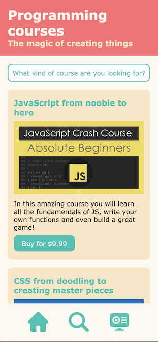
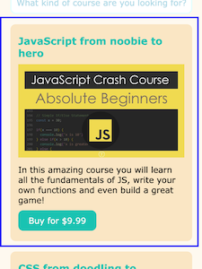
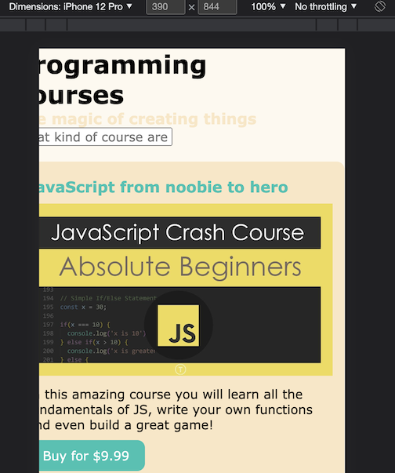
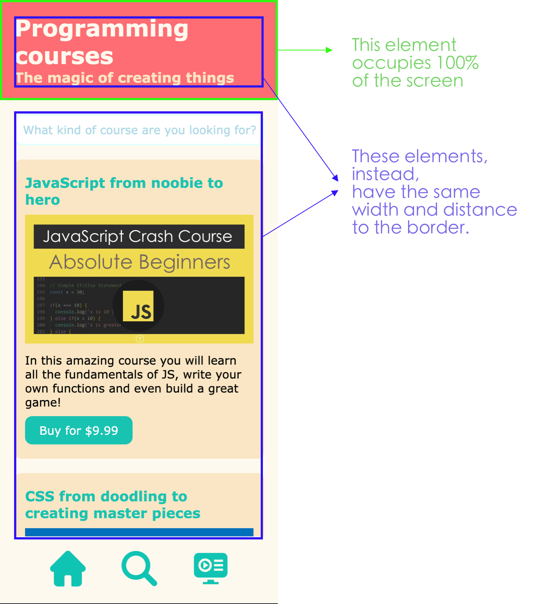
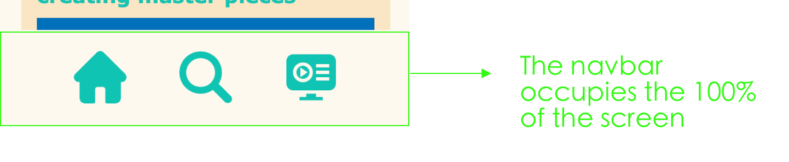

# CSS challenge #1 📱 The mobile basic layout

When learning CSS, the most difficult thing is not usually which CSS selectors and properties to apply, but to know **which elements do we apply them to**. 

One of the most beneficial things to learn is which HTML containers to create and how to group the elements in order to make the styling as easier as possible. 

> ⚠️ Note: there are **many** ways to style layouts. This is NOT the only correct way, in fact, there are really advanced techniques for pretty much anything. This will focus on using simple CSS features that you have already seen.

Today we will recreate a really basic mobile layout. We will NOT be doing it responsive (yet). We have been given this design:



Observe 👀:
- The navbar is sticked to the end of the page (even when the user is scrolling down)
- All the elements on the page have the SAME width and space to the border. It looks homogeneous.

---

## What's in the code?

- Basically, a bunch of HTML elements and cards that are not grouped yet. You will fix that later.
- Some basic CSS styling. We have introduced *CSS variables*, a really interesting technique that you will learn today.

In CSS, we can create variables just like in JavaScript. Why? Because writing stuff like "#17c3b2" all the time is really hard to remember, or at least harder than remembering "blue".

### How do we create CSS variables?

```css
/* In the root of the page, you create them, as many as you want, with the following syntax: */
:root {
  --primary-blue: #17c3b2;
  --primary-orange: #fe6d73;
  --main-margin: 10px;
}

/* And then you can use them anywhere with the following syntax: */
h1 {
  color: var(--primary-blue);
}
```

⚠️ You **don't** have to create any more variables in this project, but you will use the ones given to you.

---

## Iteration 1: The cards

Let's think about the final result we want. Then, TRY to write the CSS properties on your own and at the end, check if your solution is right.



From the design, we know that:

- The card has backgrund-color orange
- The card has some padding (20px top and bottom, and 15px right and left)
- The card has rounded corners of 10px. Which property is used for that?
- The card has space between itself and the elements on top (margin)
- The card's image should occupy the 100% of its parent (the card itself), and should have some margin with the parents above and underneath (margin top and bottom of 10px) so that we can read the text comfortably.

The card's **button** also has some colors and properties to make it prettier:
- It has blue background color
- The text is white
- It doesn't have any borders
- It has 10px of padding on top and bottom and 20px on the sides
- It has some margin on top (10px) so that it's separated from the text
- It also has rounded corners (10px)

<details>
<summary>Check the solution when you are done</summary>

```css
article.card {
  background-color: var(--primary-orange);
  width: 100%;
  padding: 20px 15px;
  border-radius: 10px;
  margin-top: 20px;
}

article.card > img {
  width: 100%;
  margin: 10px 0;
}

article.card > button {
  background-color: var(--primary-blue);
  color: var(--basic-white);
  border: none;
  padding: 10px 20px; 
  margin-top: 10px;
  border-radius: 10px;
}
```

</details>
<br>

The card looks much nicer, but we have a problem ⚠️: if you inspect the webpage with Chrome dev tools, you will see that we have to scroll right to see the whole content (so the cards are not 100%, but actually a little more). 



That's because (and pay attention, because this is a biggie): **HTML and CSS by default ADD the values of width, padding, and margin**. So if we way: width 100px, and padding of 20px, the final result is width = 140px (100px width + 20px padding right + 20px padding left)

But we don't want that, we want that if we say "width: 100px", the final width be 100px. And if we add some padding, it should **substract** the padding from the whole width of the element. We have a property for that. Add, in the universal selector (*), the following property, so that it is applied in ALL of the elements of our project:

```css
* { /* This is the universal selector */
  margin: 0;
  padding: 0;
  font-size: 16px;
  font-family: Verdana, Geneva, Tahoma, sans-serif;
  /* Add this: */
  box-sizing: border-box; /* You should always have this line in your code */
}
```

Now check the webpage in the browser and see the difference: we don't need to scroll left or right to see the content. 

The content is still touching the borders of the screen, we'll handle that now.

---

## Iteration 2: The layout container

Let's take a moment to think about the final result we want (that we have in our previous design):



We see that some elements have the same width and distance. We will use a container, and we will reuse that container all the time in our app to make sure it feels homogeneous and nice.

First let's add the <code>container</code> to the HTML, in the two places we will need it:

```html
    <div class="container">
      <h1>Programming courses</h1>
      <h3>The magic of creating things</h3>
    </div>
  ````
```html
    <div class="container"><!-- We encapsulate the form and the cards in the container-->

      <form action="/search" method="GET">
      </form>

      <article class="card">
      </article>

      <article class="card">
      </article>

      <article class="card">
      </article>

      <article class="card">
      </article>

  </div><!-- End container -->
```

Now that our elements are nicely encapsulated, let's add the CSS. Our div "container" will occupy 100 of the viewport's width, and will have 20px padding.

<details>
<summary>Check the solution when you are done</summary>

```css
div.container {
  width: 100vw;
  padding: 20px;
}
```
</details>
<br>

Looking better now?

---
## Iteration 3: The navbar

Navbars are usually composed of lists, because it makes them very accessible to people browsing through a screenreader (blind people, etc.). But that doesn't mean we WANT the list styles, so let's get rid of them:

Let take a second and think about the final result we want and let's add the code:


- The navbar occupies the 100% of the viewport's width and has 20px of padding. The background is the "basic white" color.
- The list (NOT the list items, NOT the nav, the LIST) **should not have the list default bullets**.
- The list ITEMS should be evenly spread through the navbar. We will use <code>display:flex</code> for that. Remember that, when we want something *flexed*, we have to apply it to the PARENT element (check out the [CSS flex cheatsheet](https://css-tricks.com/snippets/css/a-guide-to-flexbox/)).
- The icons of the navbar should have 50px of width.
- And now the hard part. We want the navbar *fixed* to the bottom of the page so that if we scroll, we still see it. Which of [these positions](https://www.w3schools.com/css/css_positioning.asp) do you think is the right one?
- When we do this previous step, the elements positioned fixed (our navbar) will be on top of the other elements, hiding or cutting the last elements (cards, buttons) of every page:


So, to make sure our navbar doesn't stay on top and hide any of the elements, cards and buttons of our application, we have to reserve some space for it. We can do that by adding some margin at the bottom of the body. How big? Approximately, the height of the navbar and a little more to give it a nice margin.

<details>
<summary>Check the solution when you are done</summary>

```css

body {
    background-color: var(--basic-white);
  /*Add this line: */
  margin-bottom: 100px;
}


nav {
  width: 100vw;
  padding: 20px;
  background-color: var(--basic-white);
  position: fixed;
  bottom: 0;
}

nav ul {
  list-style-type: none;
  display: flex;
  justify-content: space-evenly;
}

nav ul li a img { /* The more specific the selector, the better */
  width: 50px;
}
```
</details>
<br>

Check the result and scroll down. What would be the difference if we used <code>position: absolute</code> for the navbar? Try and see.

---
## Iteration 4: Final touches

### The input styles

We have a search bar that looks a little ugly with the default styles. Let's add some styles:

- Input should have 100% width (of the parent element, which right now is our container)
- 10px of padding
- Rounded corners of 10px
- The border is of 2px, solid, and primary blue
- The text of the placeholder is also primary blue. Search [how to style a placeholder](https://developer.mozilla.org/es/docs/Web/CSS/::placeholder) and try on your own before looking at the answer.

<details>
<summary>Check if you did it right</summary>

```css
/******* Search input *******/

form > input.search-input {
  width: 100%; 
  padding: 10px;
  border-radius: 10px;
  border: 2px solid var(--primary-blue);
}

form > input.search-input::placeholder {
  color: var(--primary-blue);
}
```
</details>

<br>

### The header

Now let's think for a second, we want to apply the styles to this part:

```html
    <div class="container">
      <h1>Programming courses</h1>
      <h3>The magic of creating things</h3>
    </div>
```

And add the red background color and a white color for the fonts. 

We have a problem: if we style the class <code>.container</code> and we add those properties, ALL the containers will look like that. Plus, it will have 20px padding, and in our design, the header occupies the 100% of the parent's width.

Solution? Let's add a new div with id "header" (just so you remember how to select 'ids' with CSS). 

Then, select it with CSS and add the red background-color and the white font.

<details>
<summary>Check the solution</summary>
<br>

HTML part:
```html
  <div id="header">
    <div class="container">
      <h1>Programming courses</h1>
      <h3>The magic of creating things</h3>
    </div>
  </div>
```

CSS part:
```css
div#header {
  background-color: var(--secondary-red);
  color: var(--basic-white);
}
```

</details>

<br>

And that's it. All done ✅!! When you are finished, [take this small quiz](https://forms.gle/nVJyqAMCQoxZHxyG7) to test your knowledge.


